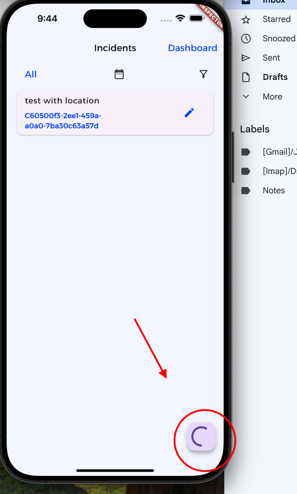

# elm_task

· Login with an email.

. Receive OTP and verify the user.

· Display the list of incidents.

· Filter the list of incidents locally (Filter by Date/Status).

. Display a dashboard with some visual charts elements.

· Post a new incident.

. Change an incident's

